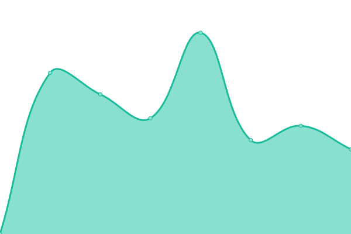

# [📈 Live Status](https://bigbang1112.github.io/bigbang1112eu-uptime): <!--live status--> **🟧 Partial outage**

This repository contains the open-source uptime monitor and status page for [Petr Pivoňka](bigbang1112.cz), powered by [Upptime](https://github.com/upptime/upptime).

With [Upptime](https://upptime.js.org), you can get your own unlimited and free uptime monitor and status page, powered entirely by a GitHub repository. We use [Issues](https://github.com/bigbang1112/bigbang1112eu-uptime/issues) as incident reports, [Actions](https://github.com/bigbang1112/bigbang1112eu-uptime/actions) as uptime monitors, and [Pages](https://bigbang1112.github.io/bigbang1112eu-uptime) for the status page.

<!--start: status pages-->
<!-- This summary is generated by Upptime (https://github.com/upptime/upptime) -->
<!-- Do not edit this manually, your changes will be overwritten -->
<!-- prettier-ignore -->
| URL | Status | History | Response Time | Uptime |
| --- | ------ | ------- | ------------- | ------ |
|  [bigbang1112.eu (redirect to cz)](https://bigbang1112.eu) | 🟥 Down | [bigbang1112-eu.yml](https://github.com/BigBang1112/bigbang1112eu-uptime/commits/HEAD/history/bigbang1112-eu.yml) | 

 1439ms
     
 | 

<a href="https://status.bigbang1112.eu/history/bigbang1112-eu">98.75%</a>
    

|  [challenge.bigbang1112.eu](https://challenge.bigbang1112.eu) | 🟩 Up | [challenge-bigbang1112-eu.yml](https://github.com/BigBang1112/bigbang1112eu-uptime/commits/HEAD/history/challenge-bigbang1112-eu.yml) | 

 823ms
     
 | 

<a href="https://status.bigbang1112.eu/history/challenge-bigbang1112-eu">99.10%</a>
    

<!--end: status pages-->

[**Visit our status website →**](https://bigbang1112.github.io/bigbang1112eu-uptime)

## 📄 License

- Powered by: [Upptime](https://github.com/upptime/upptime)
- Code: [MIT](./LICENSE) © [Anand Chowdhary](https://anandchowdhary.com), supported by [Pabio](https://pabio.com)
- Data in the `./history` directory: [Open Database License](https://opendatacommons.org/licenses/odbl/1-0/)
